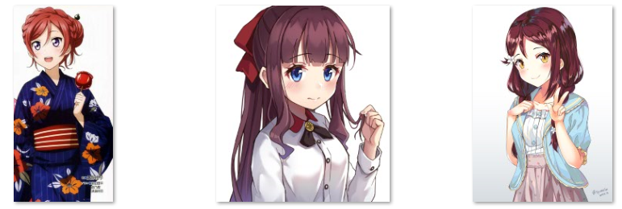
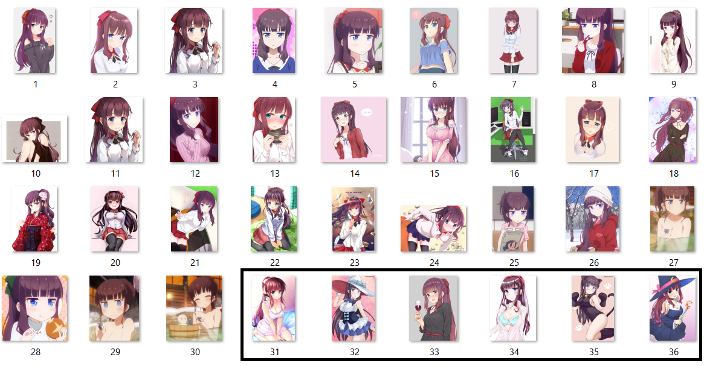

# Transfer Learning for Anime Characters

This repository is the continuation of [Flag #15 - Image Recognition for Anime Characters](http://freedomofkeima.com/blog/posts/flag-15-image-recognition-for-anime-characters).

 is created by [nagadomi/lbpcascade_animeface](https://github.com/nagadomi/lbpcascade_animeface).

Warning: This repository size is quite big (approx. 100 MB) since it includes training & test images.

## Introduction

In Flag #15, we can see that Transfer Learning works really well with 3 different anime characters: Nishikino Maki, Kotori Minami, and Ayase Eli.


In this experiment, we will try to push Transfer Learning further, by using 3 different anime characters which have hair color similarity: Nishikino Maki, Takimoto Hifumi, and Sakurauchi Riko.



This experiment has 3 main steps:
1. Utilize `lbpcascade_animeface` to recognize character face from each images
2. Resize each images to 96 x 96 pixels
3. Split images into training & test before creating the final model


`raw` directory contains 36 images for each characters (JPG & PNG format). The first 30 images are used for training while the last 6 images are used for test.



As an example, we got the following result after applying Step 1 (`cropped` directory is shown at the right side):


`lbpcascade_animeface` can detect character faces with an accuracy of around **83%**. Failed images are stored in `raw (unrecognized)` for future improvements.

Since we have 3 characters and 6 test images for each which are not part of training, `resized_for_test` contains 18 images in total. Surprisingly, **all characters** are detected properly with 0% top-1 error rate!

## Requirements

- OpenCV (https://github.com/opencv/opencv)
- TensorFlow (https://github.com/tensorflow/tensorflow)

## Steps

1. The following command is used to populate `cropped` directory.

```
$ python bulk_convert.py raw/[character_name] cropped
```

2. The following command is used to populate `resized_for_training` & `resized_for_test` directory.

```
$ python bulk_resize.py cropped/[character_name] resized
```

After running the step above, you can decide how many images will be used in `resized_for_training` and how many images will be used in `resized_for_test`.

3. Re-train the Inception model by using transfer learning:

```
$ bazel-bin/tensorflow/examples/image_retraining/retrain --image_dir ~/transfer-learning-anime/resized_for_traning/
$ bazel build tensorflow/examples/image_retraining:label_image
```

4. At this point, the model is ready to use. We can run the following command to get the classification result:

```
$ bazel-bin/tensorflow/examples/image_retraining/label_image --graph=/tmp/output_graph.pb --labels=/tmp/output_labels.txt --output_layer=final_result:0 --image=$HOME/transfer-learning-anime/resized_for_test/[character name]/[image name]
```

If everything works properly, you will get the classification result.  See [TensorFlow Documentation](https://www.tensorflow.org/tutorials/image_retraining) for more options.

## Result Analysis

## License

Copyright for all images are owned by their respective creators.
